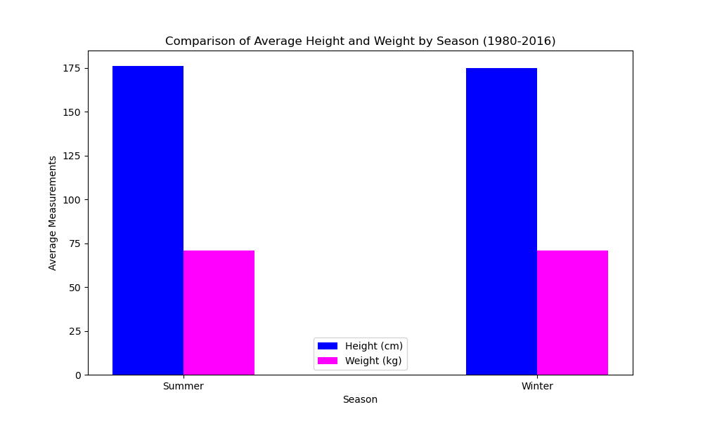
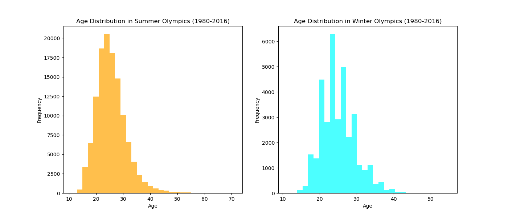
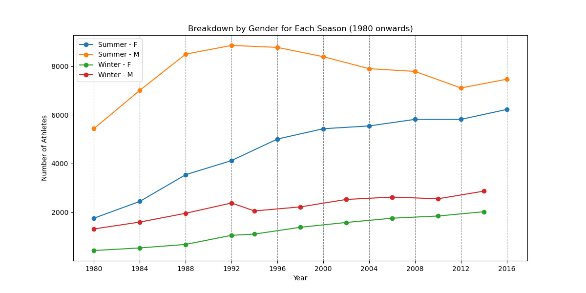
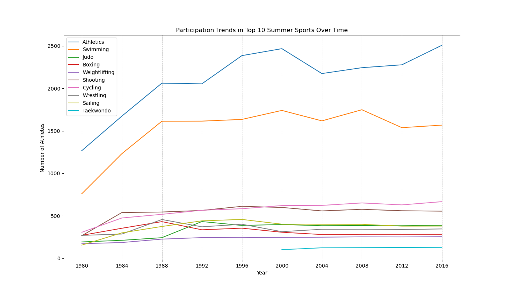
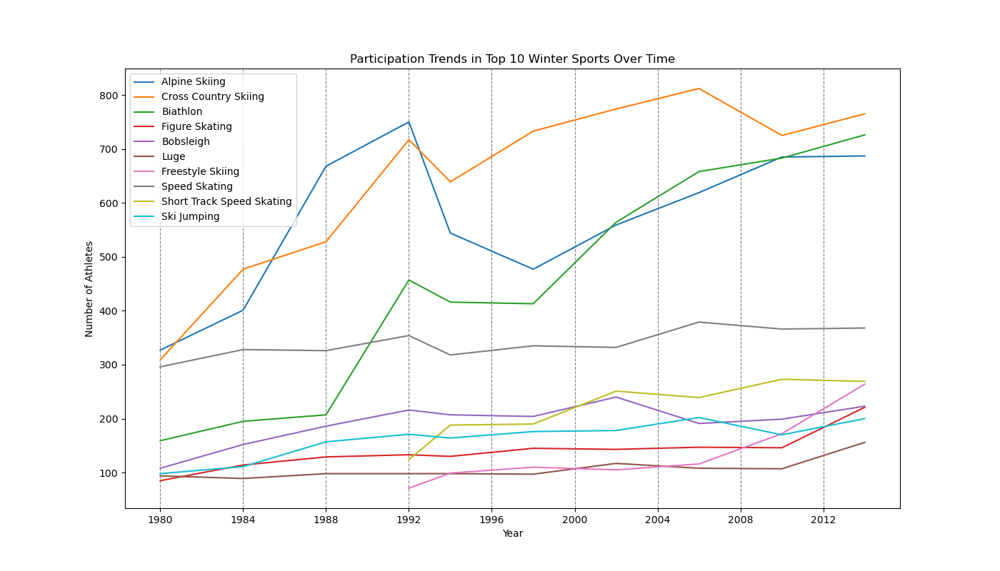
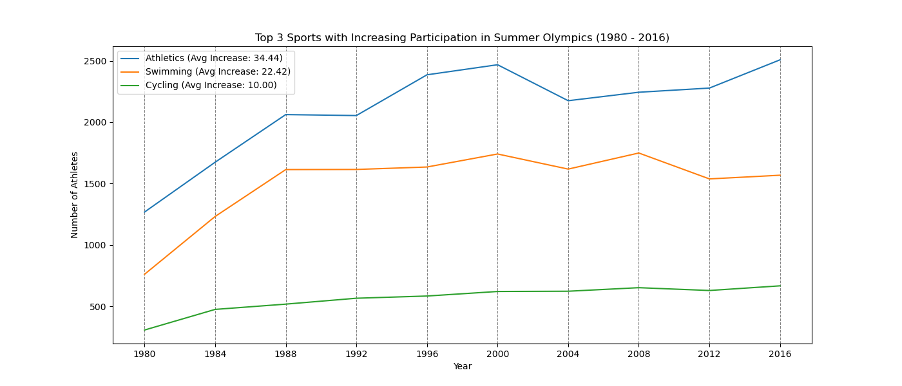
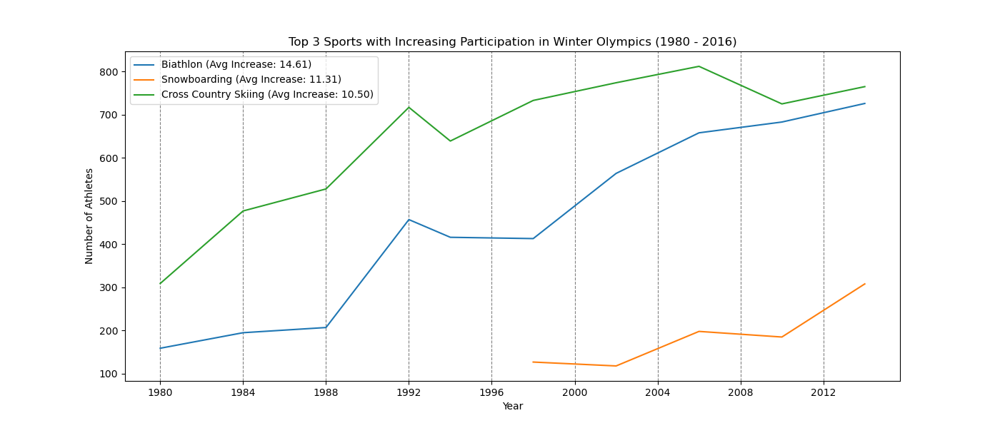
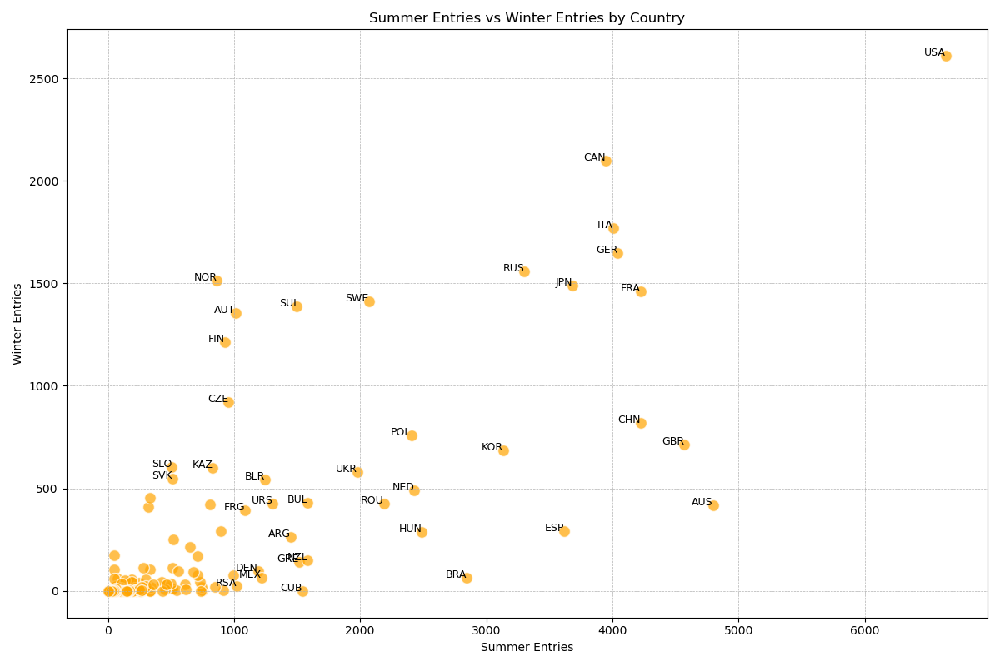
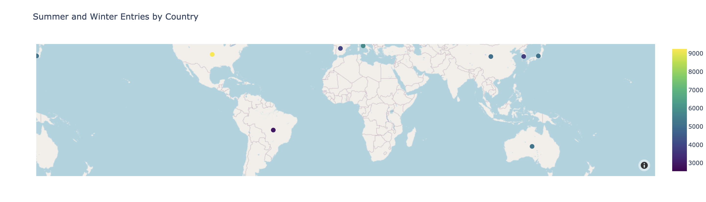
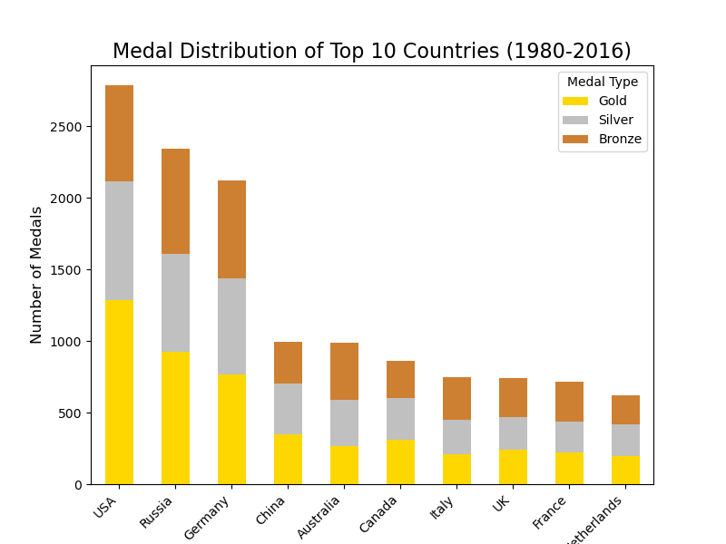

# Olympics Analysis 1980 - 2016

## Overview
This project presents an in-depth analysis of the Olympic Games from 1980 to 2016, focusing on both the Summer and Winter Olympics. The study explores a wide range of factors including athlete participation, physical attributes, age distribution, gender distribution, popular sports, geographic participation, and the performance of countries in terms of medal counts. Additionally, it examines how hosting the Olympics impacts a country's performance. The analysis aims to uncover trends, patterns, and insights that highlight the evolving dynamics of global competition in the Olympics.

## Team Members
- Lynn Foster Jr
- Kahan Shah
- Patricia Taylor
- Rahmeen Zindani

## Contents
1. [Physical Attributes](#physical-attributes)
2. [Age Distribution](#age-distribution)
3. [Distribution of Athletes by Season](#distribution-of-athletes-by-season)
4. [Popular Sports](#popular-sports)
5. [Athlete Participation Over Time](#athlete-participation-over-time)
6. [Geographic Analysis](#geographic-analysis)
7. [Countries Winning the Most Gold Medals](#countries-winning-the-most-gold-medals)
8. [Conclusion](#conclusion)

## 1. Physical Attributes
**Objective**: Explore the average height and weight of athletes across the Summer and Winter Olympics to understand the physical demands of each season.

- **Key Findings**:
  - Athletes in both Summer and Winter Olympics have similar average heights, with Summer athletes being slightly taller on average.
  - The average weight of athletes is also very close between the two seasons.
  - Most athletes fall within the 160-180 cm height range and 50-80 kg weight range, with a slightly wider distribution in weight for Summer athletes.

**Figures**:
- Average Height and Weight Comparison: 

## 2. Age Distribution
**Objective**: Analyze the age trends of athletes in the Summer and Winter Olympics to reflect the demands of different sports.

- **Key Findings**:
  - The age distribution for both Summer and Winter Olympics predominantly falls within the 20-30 year age range.
  - The peak age for athletes is slightly younger in the Winter Olympics compared to the Summer Olympics.
  - The Winter Olympics show a wider age distribution, with more athletes participating across a broader range of ages.

**Figures**:
- Age Distribution by Season: 

## 3. Distribution of Athletes by Season
**Objective**: Examine the gender distribution of athletes in the Summer and Winter Olympics.

- **Key Findings**:
  - There was a significant increase in both male and female participation from 1980 to 2016, with female participation growing at a much higher rate.
  - The Winter Olympics saw a greater percentage increase in both male and female participants compared to the Summer Olympics.

**Figures**:
- Gender Distribution Over Time: 

## 4. Popular Sports
**Objective**: Identify the most popular sports in the Summer and Winter Olympics and analyze how participation trends in these sports have evolved since 1980.

- **Key Findings**:
  - **Summer Olympics**: Athletics, Swimming, and Judo are the most popular sports, with Athletics leading in terms of the number of participating countries and athletes.
  - **Winter Olympics**: Alpine Skiing, Cross Country Skiing, and Biathlon are the most popular, with Alpine Skiing having the highest number of participating countries.

**Figures**:
- Popular Sports Analysis: 
- Popular Sports Analysis: 

## 5. Athlete Participation Over Time
**Objective**: Analyze the participation of new versus returning athletes in the Summer and Winter Olympics.

- **Key Findings**:
  - More athletes participate in the Summer Olympics compared to the Winter Olympics.
  - The number of returning athletes has remained steady over the years, particularly in the Summer Olympics.

**Figures**:
- Participation Over Time: 
- Participation Over Time: 

## 6. Geographic Analysis
**Objective**: Identify which countries have the highest participation in the Summer and Winter Olympics.

- **Key Findings**:
  - The USA, Canada, and Italy are among the countries with the highest participation in both seasons.
  - Participation is generally higher in the Summer Olympics compared to the Winter Olympics.

**Figures**:
- Geographic Participation: 
- Geographic Participation: 

## 7. Countries Winning the Most Gold Medals
**Objective**: Determine which countries win the most gold medals in the Summer and Winter Olympics and assess the impact of hosting the Games on a country's performance.

- **Key Findings**:
  - The USA leads the overall medal count, dominating in the Summer Games, while Germany and Russia perform strongly across both seasons.
  - Hosting the Olympics can significantly boost a country's medal count, as evidenced by Canada during its host years.

**Figures**:
- Medal Distribution and Hosting Impact: 

## 8. Conclusion
The analysis of the Olympic Games from 1980 to 2016 reveals several key trends:
1. **Participation Growth**: Athlete participation has surged, especially among women—Summer Olympics female participation increased by 254%, and Winter by 370%.
2. **Physical and Age Characteristics**: Athletes in both seasons have similar physical attributes, with slight age differences in peak performance—24-25 years for Summer and 22-23 years for Winter.
3. **Geographic Insights**: The USA, Canada, and Italy show strong participation across both seasons, with Canada excelling in Winter sports. Hosting the Games boosts medal counts, as seen with Canada.
4. **Popular Sports**: Athletics and Swimming dominate Summer, while Alpine Skiing and Biathlon lead Winter. Participation in these sports continues to grow.
5. **Medal Dominance**: The USA excels in Summer Games, while Germany, Russia, and Canada perform strongly in Winter.

## Dependencies
To run this analysis, ensure that the following Python libraries are installed:
- Pandas
- Matplotlib
- Plotly
- Numpy
